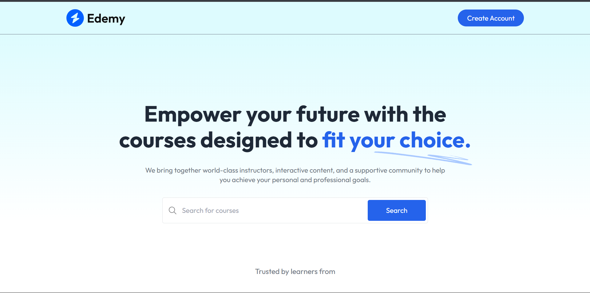
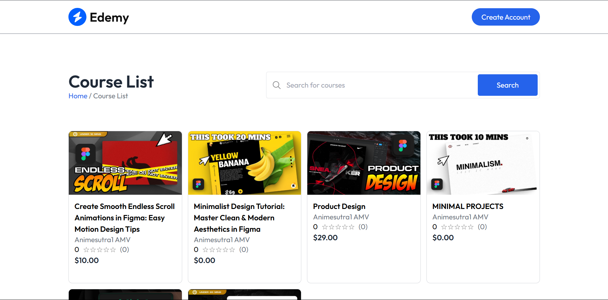
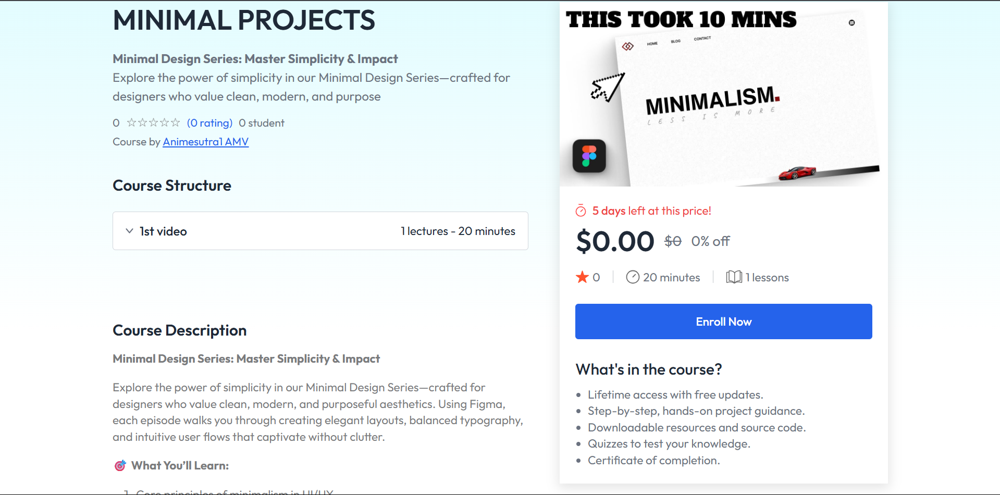
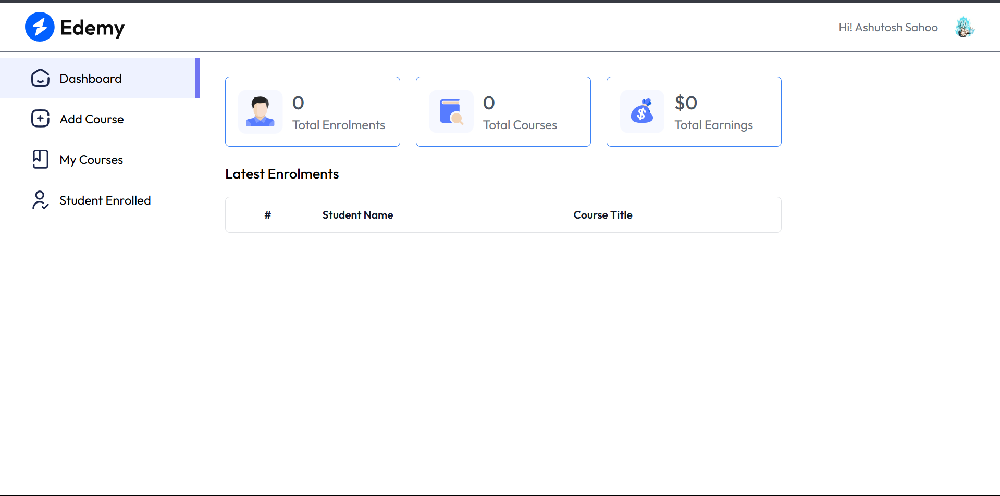

# 📚 Edemy – Interactive LMS Web Application

An interactive, full-stack **MERN-based Learning Management System (LMS)** that enables instructors to create and share online courses with embedded video content, and students to enroll and learn seamlessly.

## 🔗 Live Demo

👉 [edemy.live](https://lms-delta-six.vercel.app/)  

## 🚀 Key Features

- 🎥 **Embedded YouTube Videos**
  - Instructors can create lessons by embedding YouTube links.
  - Learners can stream videos directly within the course interface.

- 🔐 **Clerk Authentication**
  - Secure sign-up and login with role-based access (Instructor & Student).
  - User session and identity management handled via **Clerk**.

- 💳 **Stripe Payment Integration**
  - Simple and secure payment flow for paid courses.

- 🔗 **Robust API Communication**
  - Managed frontend-backend interaction using **Axios**.
  - Ensured cross-origin compatibility with proper **CORS configuration**.

## 🛠️ Tech Stack

- **Frontend:** React.js, Clerk, Axios
- **Backend:** Express.js
- **Database:** MongoDB
- **Authentication:** Clerk
- **Payments:** Stripe

## 📸 Preview

###  Home Page

###  Courses

###  Course Detail

###  Educator Dash

## 📬 Contact

If you're interested in the implementation or want to discuss this project, feel free to reach out via [LinkedIn](https://www.linkedin.com/in/ashutosh-sahoo-32067b110/) or email at `ashutoshsahoo1985@gmail.com`.

---

